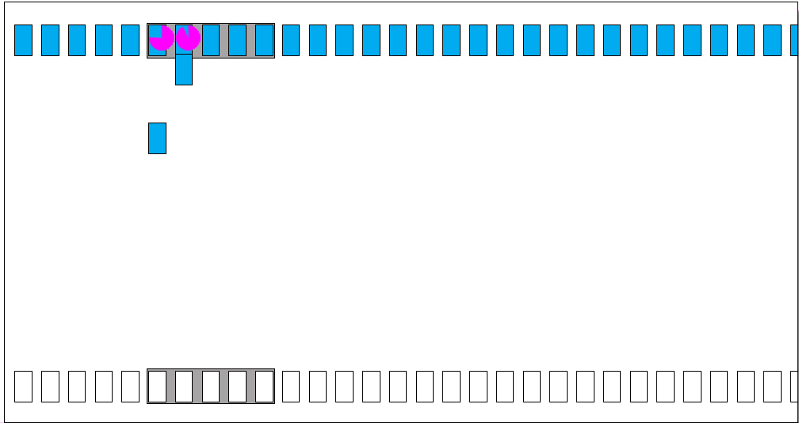

Sliding Window Protocol
=====
Sliding window is a technique for controlling transmitted data packets between two network computers where reliable and sequential delivery of data packets is required, such as when using the Data Link Layer (OSI model) or Transmission Control Protocol (TCP). But in this project, we try to implement sliding window over **UDP socket** using **C++**.

In the sliding window technique, each data packet and byte includes a unique consecutive sequence number, which is used by the receiving computer to place data in the correct order. The objective of the sliding window technique is to use the sequence numbers to avoid duplicate data and to request missing data.

Sliding window is also known as windowing.

## Overview
- [Background](#background)
- [Visualization for Sliding Window Protocol](#visualization-for-sliding-window-protocol)
- [Implementation](#implementation)
- [How to Use](#how-to-use)
- [Simulating Packet Loss](#simulating-packet-loss)
- [Contributors](#contributors)
- [References](#references)

## Background
This project exists in order to accomplish our computer networks class task. Beside that we also want to explore about this topic, as we know that communication between computer is the base of everyone need, internet.

## Visualization for Sliding Window Protocol


We implemented the Sliding Window Protocol using Selective Repeat Protocol that requires the receiver to receive out of order data. Because of this requirement, the receiver must be able to buffer the packets. This protocol retransmits the data under 2 condition:
1. The receiver never received the packet, or the packet is recieved but the Acknowlendgement (ACK) of that packet never reaches the sender. We assume that the packet or the ACK is lost in transmission, hence the sender retransmits the packet after a timeout.
2. The receiver received the packet, but the packet is invalid because it has a wrong checksum. Then the receiver sends a Negative Acknowledgement (NAK) to notify the sender to begin retransmission immediately.

### Packets and Buffers
Data sent using the sliding window protocol is divided into packets (frames) that has a fixed maximum length. Each packet has a unique sequence number that is used reorder the packets into the complete data once the transmission is complete. Since the data being sent can be quite large, the data is first divided into buffers and the transmission is done in a per-buffer basis. In each buffer, the packets are given a sequence number that starts from zero. Hence, to disambiguate between buffers at the reciever, the buffer size must be more than twice the window size.

### Sender
The sender defined a window that is marked by the Last Acknowledgement Received (LAR) and Last Frame Sent (LFS) variables. At first, the sender sends all the packets in the window and waits for each of their corresponsing ACKs. Everytime an ACK is recieved, the sender will shifts its window until the smallest un-ACK-ed sequence number is at LAR + 1. Notice that the window is not shifted everytime an ACK arrives, this is because ACKs can arrive in out of order. That is why the window is shifted only if it is possible.

### Receiver
The receiver defined a window that is marked by the Last Frame Received (LFR) and Largest Acceptable Frame (LAF) variables. When the receiver accepts a frame, it will sends and ACK of that frame if the checksum is valid, and else it will sends a NAK.
Then, just like the sender, the receiver will shifts its window until the smallest unreceived sequence number is at LFR + 1.

## Implementation
We implement this sliding window protocol over a UDP socket using C++. In our program there are two main files, `recvfile.cpp` and `sendfile.cpp`, that handles everything from sending ACK if the frame is valid, resending the frame if timeout occurs, and resend the frame right away if NAK is received. There's one additional file, `definitions.cpp`, that contains checksum function and initial static variables.

### sendfile
We use two threads on our `sendfile.cpp` in order to implement the sliding window protocol. The first thread is to send the packets to the client, while the other one is to receive ACK or NAK from the client. We run **listen_ack()** function on `sendfile.cpp` on a new thread. Using multiple threads, our sendfile could send frames and receive ACK on the same time.
We also implement a mutex lock in order to maintain the integrity of the data that was used parallelly between two threads.

### recvfile
On our `recvfile.cpp`, we will receive frame from the sendfile, check whether the frame that recvfile received is correct or not using checksum, and send ACK/NAK to the sendfile. Recvfile will write buffer per buffer into a new file.

## How to Use
In order to use this program, you need to have C++ compiler that runs on Unix operating system. Here are some steps:

1. Make
```
$ make
```
2. Clean executable file
```
$ make clean
```
3. Run Receiver
```
$ ./recvfile <filename> <window_size> <buffer_size> <port>
```
example:
```
$ ./recvfile data/sample.txt 20 1000 5050
```
4. Run Sender
```
$ ./sendfile <filename> <window_size> <buffer_size> <ip> <port>
```
example:
```
$ ./sendfile data/received.txt 20 1000 127.0.0.1 5050
```

## Simulating Packet Loss
To test the ability of retaining integrity and order of the transmission in the case of a packet loss, we can simulate a packet loss using this command on Linux:
```
$ sudo tc qdisc add dev lo root netem loss <loss_rate>
```
example:
```
$ sudo tc qdisc add dev lo root netem loss 50%
```
to reset:
```
$ sudo tc qdisc change dev lo root netem loss 0%
```

> `buffer_size` and `window_size` on both recvfile and sendfile must be the same. 

## Contributors
1. Kelvin Kristian https://github.com/kelvinkristian
2. Dandy Arif Rahman https://github.com/daandeey
3. Renjira Naufal https://github.com/renjiraND

## References
* [Computer Networks: A Systems Approach (The Morgan Kaufmann Series in Networking) 5th Edition](https://www.amazon.com/Computer-Networks-Fifth-Approach-Networking/dp/0123850592)
